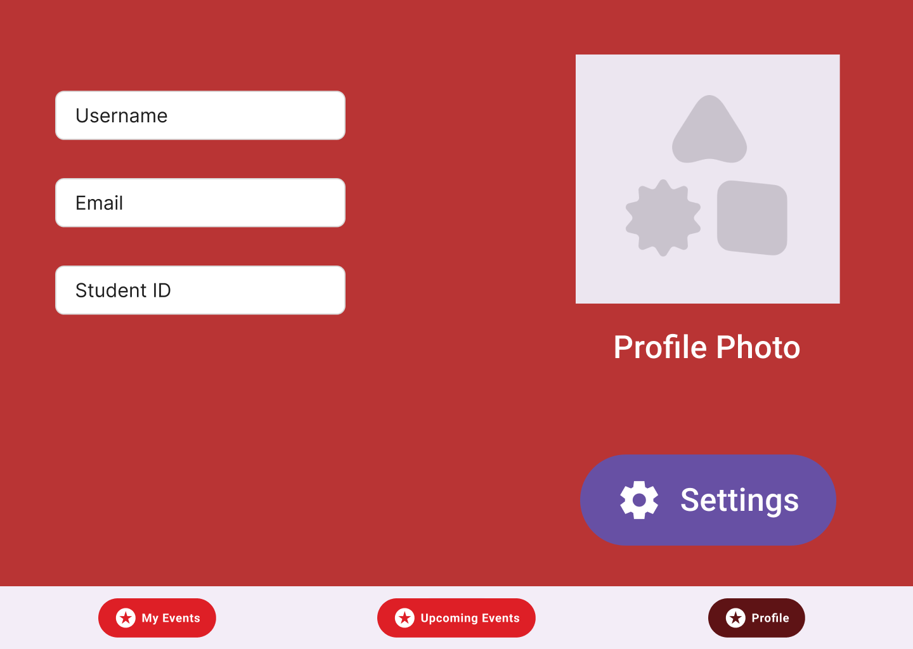

# Final Project – Group 3

**Campus Event Tracker – Design Document**

---

## 1. Introduction

The **Campus Event Tracker** is a mobile/web application designed to help students discover, RSVP to, and receive reminders for campus events. It centralizes event information from various departments and student organizations, making it easier for students to stay engaged with campus life.

---

## 2. Storyboard (Screen Mockups)

**Screens:**



---

## 3. Functional Requirements

**Requirement 1**

* *As a student*
* I want to browse upcoming campus events
* So that I can decide which ones to attend

**Acceptance Criteria:**

* Given I am logged in
* When I open the event feed
* Then I see a list of upcoming events with key details

---

**Requirement 2**

* *As a student*
* I want to RSVP to events
* So that I can receive reminders and updates

**Acceptance Criteria:**

* Given I am viewing an event
* When I click **RSVP**
* Then the event is added to my calendar and I receive notifications

---

**Requirement 3**

* *As an event organizer*
* I want to create and publish events
* So that students can discover and attend them

**Acceptance Criteria:**

* Given I am logged in as an organizer
* When I fill out the event creation form
* Then the event appears in the public feed

---

## 4. Class Diagram


---

## 5. Class Diagram Description

* **User:** Represents a student using the app to browse and RSVP to events.
* **Event:** Represents a campus event with metadata and attendee list.
* **Organizer:** Represents a user with permissions to create and manage events.

---

## 6. JSON Schema

Draft schema for the `/events` endpoint:

```json
{
  "$schema": "http://json-schema.org/draft-07/schema#",
  "title": "CampusEvent",
  "type": "object",
  "properties": {
    "id": { "type": "string" },
    "title": { "type": "string" },
    "description": { "type": "string" },
    "date": { "type": "string", "format": "date-time" },
    "location": { "type": "string" },
    "attendees": {
      "type": "array",
      "items": { "type": "string" }
    }
  },
  "required": ["id", "title", "date", "location"]
}
```

---

## 7. Scrum Roles

* **GitHub Administrator:** Gray Andrews
* **Product Owner:** \ Group 3
* **Scrum Master:** \ Sid Bade
* **DevOps:** \ Sid Bade
* **Frontend Developer:** Maurice Dennis
* **Backend Developer:** Sid Bade

---

## 8. GitHub Project Link

🔗 [GitHub Repository](https://github.com/AGray551)

**Milestones:**

* **Milestone #1:** User login, event feed, RSVP functionality
* **Milestone #2:** Notifications
* **Milestone #3:** Calendar integration, polish

Tasks and user stories are organized in GitHub Projects under **Milestone #1**.

---

## 9. Weekly Stand-Up Meeting

* **Time:** Sundays at 8:00 AM
* **Platform:** Microsoft Teams
* **Meeting Link:** [Join Meeting](https://teams.microsoft.com/meet/2591305635954?p=y6A2X4Zyvo2UQgz9q0)

---
